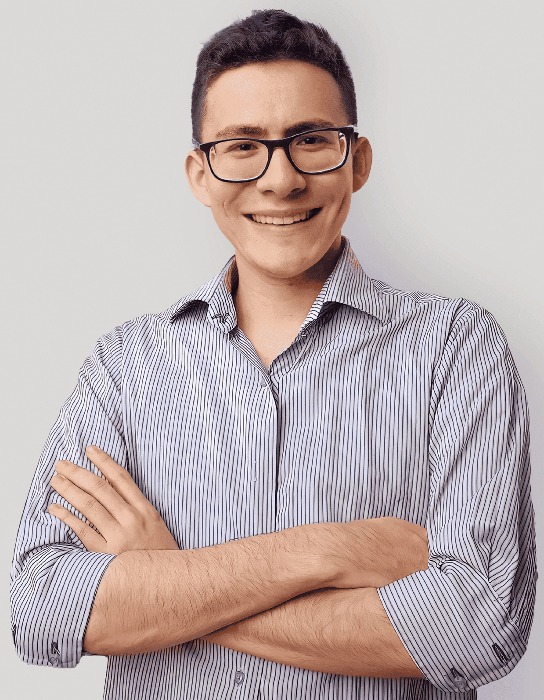
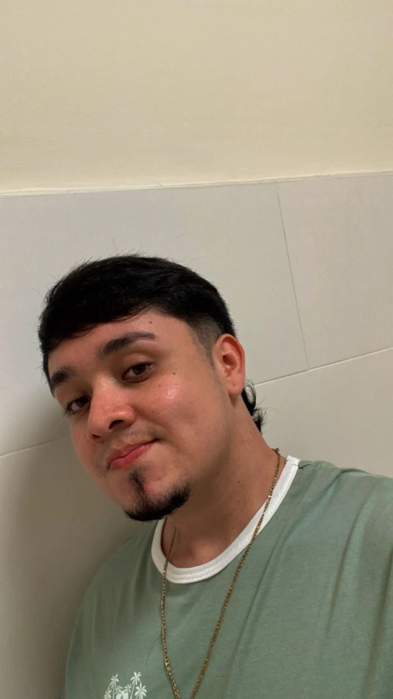
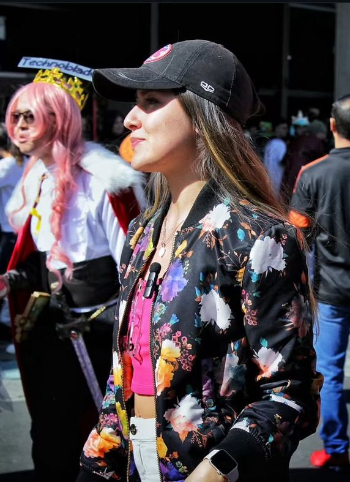
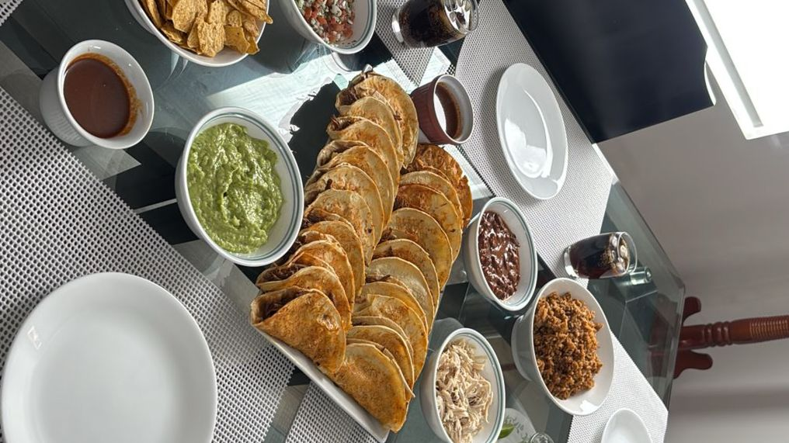

<h1>Julio Medina</h1>

<h3>Rol en la industria</h3>

Marketing Multimedia y Producción Fotográfica

<h3>Ubicación</h3>

La Guajira

<h3>Perfil</h3>

Me enfoco mas al marketing multimedia que fue mi línea de profundización, conociendo proceso de producción de imagen, audio y video, tengo un emprendimiento en fotografía de eventos y me familiarizo con el uso de herramientas como la suite de Adobe, Canva, figma, Wix.

---

<h1>Jose Jaimes</h1>

<h3>Rol en la industria</h3>

Diseñador de sonido

<h3>Rol en la industria</h3>

Cúcuta - Colombia

<h3>Perfil</h3>

Mi nombre es Jose David Jaimes Hernandez, estudiante de Ingeniería Multimedia del CEAD ZCORI (Zona Centro Oriente), tengo 24 años y me apasiona la tecnología. Apoyaré el desarrollo de este proyecto con todas mis habilides y nuevos aprendizajes. 

<h3>Comida favorita</h3>

Lasaña

---

# Sergio Calvo

## Rol en la industria
Diseñador Gráfico y Desarrollador Multimedia

## Ubicación
Cúcuta, Colombia

## Perfil
Soy estudiante de Ingeniería Multimedia, apasionado por el diseño y la creación de contenido digital.  
Me interesa el uso de la tecnología en la educación, la publicidad y el entretenimiento, aplicando la creatividad en cada proyecto que realizo.

---

<h2>Darwin Calderon</h2>

<h3>Rol Escogido</h3>

Diseñador Gráfico y Editor Multimedia

<h3>Ubicación</h3>

Bucaramanga - Colombia

<h3>Perfil</h3>

Estudiante del programa Ingeniería Multimedia, con una trayectoria laboral de 7 años en el área de diseño gráfico y asesor comercial,
mi meta es poder graduarme y aportar cada uno de los conocimientos obtenidos en mi labor como profesional y mi diario vivir, siempre llevando
todo un paso más allá.

<h3>Comida Favorita</h3>

Mi comida favorita es la Pechuga a la Plancha

    

 <h1>Sofía Naranjo</h1>

  

<h3>Rol en la industria</h3>
    
<strong>Game Designer</strong>

 <h3>Ubicación</h3>
    
Bucaramanga, Santander, Colombia

 <h3>Perfil</h3>
    
Mi nombre es Sofía Naranjo Díaz, estudiante de Ingeniería Multimedia, apasionada por el diseño y desarrollo de videojuegos. 
    Me interesa crear experiencias interactivas innovadoras y en el futuro quiero realizar un diplomado en diseño de videojuegos en Canadá.

<h3>Comida Favorita</h3>

Tacos De Birria

